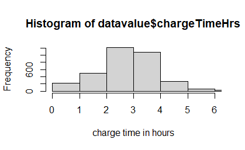
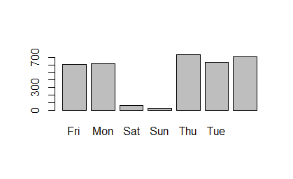

# Overview

I wanted to learn another IDE as well as another programming language, and I thought that language of R would be a different language to learn as well as learning how to properly use r studio.

I was curious about electric cars as that seems to be the shift that we are moving towards with our personal transportation. i got this data from kaggle the link to the datasource is [here](https://www.kaggle.com/datasets/michaelbryantds/electric-vehicle-charging-dataset). The dataset includes information such as what day of the week they charged, how long they charged, what they spent charging.

The purpose of this software was intitially to learn more about data analysis using R and it turned into R libraries troubleshooting. But once I was finally able to get the libraries configured correctly the code was really simple to get it to work and filter and produce graphs in a single word a graph was made which was really cool to learn and use. 
{Provide a link to your YouTube demonstration.  It should be a 4-5 minute demo of the data set, the questions and answers, the code running and a walkthrough of the code.}

[Software Demo Video](https://youtu.be/xdQqF9TfUn8)

# Data Analysis Results

I wanted to know the average time it takes to charge a vehicle, A lot of car companies say you can charge it up 80% in 30 minutes on a level 3 charger, which is great to know but if all the chargers are not level three how long am I going to be sitting at a charger on average. The answer to that is 2.8 hours on a charger.

The other question once I learned on average you are looking at 2.8 hours on a charger was which day of the week is the best day to charge to your eletric vehicle and it turns out that Saturday and Sunday are the best days to charge with signicantly disproportionate amount of people not charging on the weekend

# Development Environment

I used the IDE of R Studio to write the code 

I used the R language, 
I used the following libraries
Rlang
TidyVerse
Stats

# Useful Websites

* [R documentation](https://www.rdocumentation.org/)
* [R project](https://www.r-project.org/other-docs.html)

# Future Work

{Make a list of things that you need to fix, improve, and add in the future.}
* I think that being able to filter out outliers would be useful someone charged their vehicle for 55 hours which will skew the average slightly higher
* I would like to figure out the average kW per hour in regards to finding out the different level of charges that are there
* Another thing that I would like to add is finding out the cost of charging, this dataset seemed to have a lot of people getting free charges either because it wasn't recording the data properly or because they paid for a unlimited subscription access pass.